# Vibe Coach

A thinking framework for domain-driven design. Helps you discover entities, build shared vocabulary, and visualize relationships.

## When to Use

Use Vibe Coach when:
- Starting a new project and need to clarify the domain
- Refactoring existing code to align with business language
- Onboarding to a codebase and need to understand the model
- Communicating architecture to stakeholders
- Feeling lost in complexity and need to "see" the system

## The Process

### 1. Discovery: What Are We Building?

Start with open questions:
- What problem does this solve?
- Who uses it? What do they call things?
- What are the key *nouns* in the domain?
- What *verbs* connect them?

**Goal:** Extract the natural language of the domain.

### 2. Glossary: Ubiquitous Language

Build a table of entities. One row per concept:

| Entity | Definition | Example | Notes |
|--------|------------|---------|-------|
| **Recipe** | A set of instructions to make a dish | Spaghetti Carbonara | Has ingredients, steps |
| **Chef** | A person who creates recipes | Gordon Ramsay | Can have multiple recipes |
| **Ingredient** | A component used in recipes | Eggs, Pasta | Has quantity, unit |

**Rules:**
- Use the domain's language, not technical jargon
- One definition per term (no synonyms in code)
- If the business calls it X, the code calls it X

### 3. Map: Entity Relationships

Visualize with Mermaid diagrams. Use stadium shapes `([text])` and plain English verbs:

```mermaid
%%{init: {'theme': 'dark', 'themeVariables': { 'fontSize': '16px', 'fontFamily': 'ui-monospace, monospace' }}}%%
flowchart LR
    Chefs(["👨‍🍳 Chefs"]) -->|create| Recipes(["🍳 Recipes"])
    Recipes -->|require| Ingredients(["🥕 Ingredients"])
    Recipes -->|have| Steps(["📝 Steps"])
```



**Diagram Principles:**
- Stadium shapes `([text])` for entities
- Emoji prefix for visual scanning
- Verbs on arrows: "have", "create", "belong to", "use"
- Flow left-to-right or top-to-bottom
- Color-code by entity type (optional but powerful)

### 4. Boundaries: Where Does Language Change?

Look for places where the same word means different things:
- "Account" in billing vs "Account" in authentication
- "Order" in e-commerce vs "Order" in sorting

These are **bounded contexts**. They may need separate models.

### 5. Decisions: Document the Why

Create a decisions log:

| Decision | Rationale | Date |
|----------|-----------|------|
| Renamed `Client` → `Agent` | Aligns with AI assistant terminology | 2024-12 |
| `Recipe` owns `Steps` | Steps don't exist without a recipe | 2024-12 |

## Color Palette for Diagrams

Assign one color per entity type. Use consistently across all diagrams:

```
Purple  (#8B5CF6) - Primary entities (the main "things")
Amber   (#F59E0B) - Actors (who does things)  
Blue    (#3B82F6) - Supporting entities
Emerald (#10B981) - Credentials/secrets
Teal    (#14B8A6) - Sources/origins
Orange  (#F97316) - Actions/events
Gray    (#6B7280) - Logs/history
```

### Styled Diagram Example

```mermaid
%%{init: {'theme': 'dark', 'themeVariables': { 'fontSize': '16px', 'fontFamily': 'ui-monospace, monospace', 'lineColor': '#6b7280', 'primaryTextColor': '#f3f4f6' }}}%%
flowchart LR
    subgraph Container[" "]
        direction LR
        Agents(["🤖 Agents"]) -->|use| Skills(["⚡ Skills"])
        Skills -->|have| Accounts(["👤 Accounts"])
        Accounts -->|store| Credentials(["🔑 Credentials"])
        Agents -->|generate| Activities(["📋 Activities"])
    end
    
    style Container fill:#1a1a2e,stroke:#4a4a6a,stroke-width:2px,rx:10,ry:10
    style Agents fill:#78350f,stroke:#f59e0b,stroke-width:2px,color:#fef3c7
    style Skills fill:#4c1d95,stroke:#a78bfa,stroke-width:2px,color:#f3f4f6
    style Accounts fill:#1e3a5f,stroke:#3b82f6,stroke-width:2px,color:#dbeafe
    style Credentials fill:#064e3b,stroke:#10b981,stroke-width:2px,color:#d1fae5
    style Activities fill:#374151,stroke:#9ca3af,stroke-width:2px,color:#f3f4f6
```



## Output: The Domain Document

A complete domain document includes:
1. **Overview** - One paragraph describing the system
2. **Glossary** - Table of entities with definitions
3. **Diagram** - Visual map of relationships
4. **Boundaries** - Where contexts separate
5. **Decisions** - Key choices and rationale

Use the `render` action to save this as a markdown file.

## Tips

- **Start messy** - Brainstorm entities freely, refine later
- **Listen for nouns** - Business people name the entities
- **Listen for verbs** - These become relationships
- **Challenge synonyms** - "User", "Customer", "Member" → pick ONE
- **Iterate** - The model evolves as understanding deepens
- **Diagrams confirm** - If you can't draw it, you don't understand it

## Example Session

**User:** "I'm building a podcast app"

**Vibe Coach response:**

Let's discover your domain. Some questions:
1. What can users DO in your app? (listen, subscribe, download?)
2. What are the main THINGS? (podcasts, episodes, playlists?)
3. Do users have accounts? What do they own?

*[After discussion, build glossary and diagram together]*

Here's what I'm hearing:

| Entity | Definition |
|--------|------------|
| **Podcast** | A show with multiple episodes |
| **Episode** | A single audio file within a podcast |
| **Subscription** | A user following a podcast |
| **Queue** | User's list of episodes to play |

```mermaid
flowchart LR
    Users(["👤 Users"]) -->|subscribe to| Podcasts(["🎙️ Podcasts"])
    Podcasts -->|have| Episodes(["🎧 Episodes"])
    Users -->|add to| Queue(["📋 Queue"])
    Queue -->|contains| Episodes
```



Does this match your mental model? What's missing?
